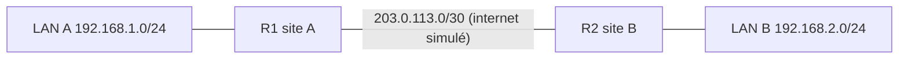

# Lab Cisco : VPN IPsec site à site

> **Statut : à réaliser.** Ce guide est préparé à partir de la documentation officielle et de mes cours ; **je ne l'ai pas encore rejoué de bout en bout**. Les commandes sont à valider en le faisant, et le journal en bas de page sera complété avec mes résultats réels (captures, erreurs rencontrées, corrections).

## Objectif

Relier **deux sites distants** par un tunnel **IPsec** (IKE phase 1 + phase 2) entre deux routeurs, de sorte que les réseaux locaux des deux sites communiquent de façon **chiffrée** à travers un réseau non sûr (internet).

## Prérequis

- Cisco Packet Tracer avec des routeurs 2911 : l'IPsec exige la licence **securityk9** (`license boot module c2900 technology-package securityk9`, puis `write memory` et `reload`). Sur du matériel réel, vérifier avec `show version` que la fonctionnalité est disponible.
- Notions : chiffrement symétrique et asymétrique, clé pré-partagée, NAT.

## Topologie



| Élément | Adresse |
|---|---|
| R1 g0/0 (LAN A) | 192.168.1.1/24 |
| R1 g0/1 (WAN) | 203.0.113.1/30 |
| R2 g0/1 (WAN) | 203.0.113.2/30 |
| R2 g0/0 (LAN B) | 192.168.2.1/24 |

Avant d'attaquer IPsec, **vérifier que les deux WAN se joignent** (ping `203.0.113.2` depuis R1) et que chaque LAN joint son routeur. Une route par défaut ou statique vers le WAN de l'autre site est nécessaire.

## Étapes

### 1. Phase 1 (IKE) : le canal de contrôle protégé

Fichier du dépôt : [`configs/R1-ipsec.txt`](configs/R1-ipsec.txt)

```text
configure terminal
crypto isakmp policy 10
 encryption aes 256
 hash sha
 authentication pre-share
 group 5
 lifetime 86400
crypto isakmp key CleLabPartagee2026 address 203.0.113.2
```

Sur R2, la même politique et la clé pour l'adresse `203.0.113.1`. Les paramètres de la **politique doivent être identiques** des deux côtés, sinon la phase 1 échoue. La clé ci-dessus est une valeur de laboratoire : en réel, longue, aléatoire et jamais publiée.

### 2. Phase 2 (IPsec) : le trafic à protéger

Fichier du dépôt : [`configs/R1-ipsec-suite.txt`](configs/R1-ipsec-suite.txt)

```text
crypto ipsec transform-set TS-LAB esp-aes 256 esp-sha-hmac
 mode tunnel
!
access-list 110 permit ip 192.168.1.0 0.0.0.255 192.168.2.0 0.0.0.255
!
crypto map CMAP-LAB 10 ipsec-isakmp
 set peer 203.0.113.2
 set transform-set TS-LAB
 match address 110
!
interface g0/1
 crypto map CMAP-LAB
end
write memory
```

L'ACL 110 définit le **trafic intéressant** : ce qui va de LAN A vers LAN B est chiffré. Sur R2, elle est **inversée** (source `192.168.2.0`, destination `192.168.1.0`) : un miroir exact est indispensable.

### 3. Si le NAT est aussi actif

Le trafic vers l'autre site ne doit **pas** être traduit. L'ACL de NAT doit d'abord refuser ce trafic :

```text
access-list 100 deny   ip 192.168.1.0 0.0.0.255 192.168.2.0 0.0.0.255
access-list 100 permit ip 192.168.1.0 0.0.0.255 any
ip nat inside source list 100 interface g0/1 overload
```

## Vérifications

```text
ping 192.168.2.10                ! d'un PC du LAN A : le premier paquet peut se perdre, le temps de négocier
show crypto isakmp sa            ! état QM_IDLE : phase 1 établie
show crypto ipsec sa             ! compteurs #pkts encaps / #pkts decaps qui augmentent
```

Bonus : capturer le trafic sur le lien WAN (Wireshark, ou mode simulation de Packet Tracer) et constater que les paquets sont des **ESP** et non des ICMP lisibles. Voir [tp-wireshark-analyse-trafic](https://github.com/mehdiseg/tp-wireshark-analyse-trafic) pour se familiariser avec la lecture des captures.

## Pièges fréquents

- Politiques ISAKMP différentes (chiffrement, hachage, groupe DH, authentification).
- Clé pré-partagée différente, ou associée à la mauvaise adresse.
- ACL non symétriques entre les deux sites.
- `crypto map` appliquée à la mauvaise interface (elle va sur l'interface de sortie vers l'autre site).
- Pas de licence `securityk9`.
- NAT qui traduit le trafic avant qu'il ne soit chiffré.

## Pour aller plus loin

- Passer à **IKEv2** ou à une interface de tunnel virtuelle (**VTI**).
- Comparer avec un VPN WireGuard : [wireguard-generateur-config](https://github.com/mehdiseg/wireguard-generateur-config).
- Ajouter un troisième site et discuter d'une topologie en étoile (*hub and spoke*).

## Références

- [RFC 4301 : Security Architecture for the Internet Protocol](https://www.rfc-editor.org/rfc/rfc4301)
- [RFC 7296 : Internet Key Exchange Protocol Version 2](https://www.rfc-editor.org/rfc/rfc7296)

## Journal de réalisation

_Lab pas encore réalisé : cette section sera remplie au fur et à mesure._

| Date | Ce que j'ai fait | Résultat | Difficultés et solutions |
|---|---|---|---|
|  |  |  |  |

## Feuille de route

Ce lab fait partie de ma [feuille de route réseau](https://github.com/mehdiseg/roadmap-reseau-bts-sio).
